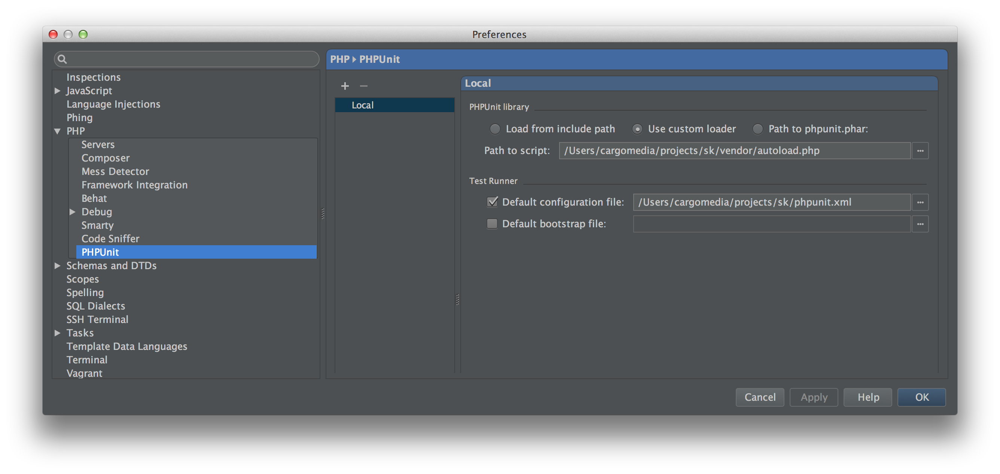

PhpStorm
========
Version 8 required.

**Vagrant PhpStorm Tunnel**

To run scripts using PHP (installed in the Vagrant virtual machine) via ssh, install
[vagrant-phpstorm-tunnel](https://github.com/cargomedia/vagrant-phpstorm-tunnel) and follow the instructions to set it up.

**PHPUnit Test Configuration**

Go to `Preferences > PHP > PHPUnit` and under `PHPUnit library` specify composer's `autoload.php` as custom loader. Under `Test runner` check the checkbox next to `Default configuration file` and select the `phpunit.xml` inside the root folder of the project you're setting up.

