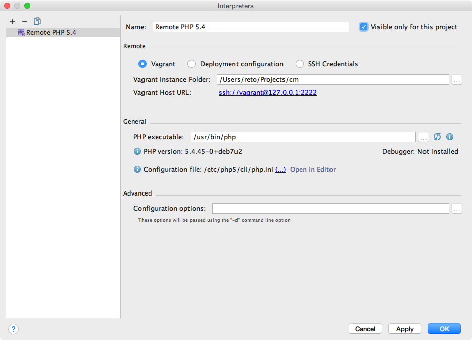
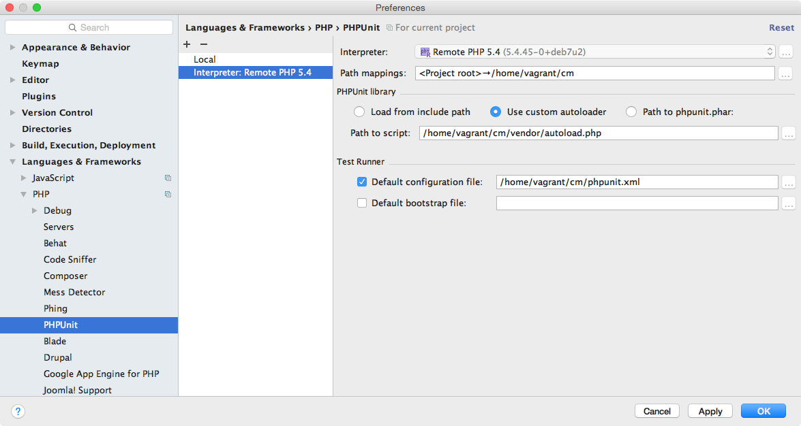

PhpStorm
========
Version 2016.1.2 required.

Vagrant PHP interpreter
-----------------------
Go to `Preferences > Languages & Frameworks > PHP` and click the `…` to add a new interpreter. Click the `+`, chose `Remote…`, select `Vagrant` and confirm with `OK`.
Check the `Visible only for this project` option and close with `OK`.

PHPUnit Test Configuration
--------------------------
Go to `Preferences > Languages & Frameworks > PHP > PHPUnit`, click the `+` and chose `By Remote interpreter`. Select the previously created *remote interpreter* and confirm with `OK`.
Configure as follows:

